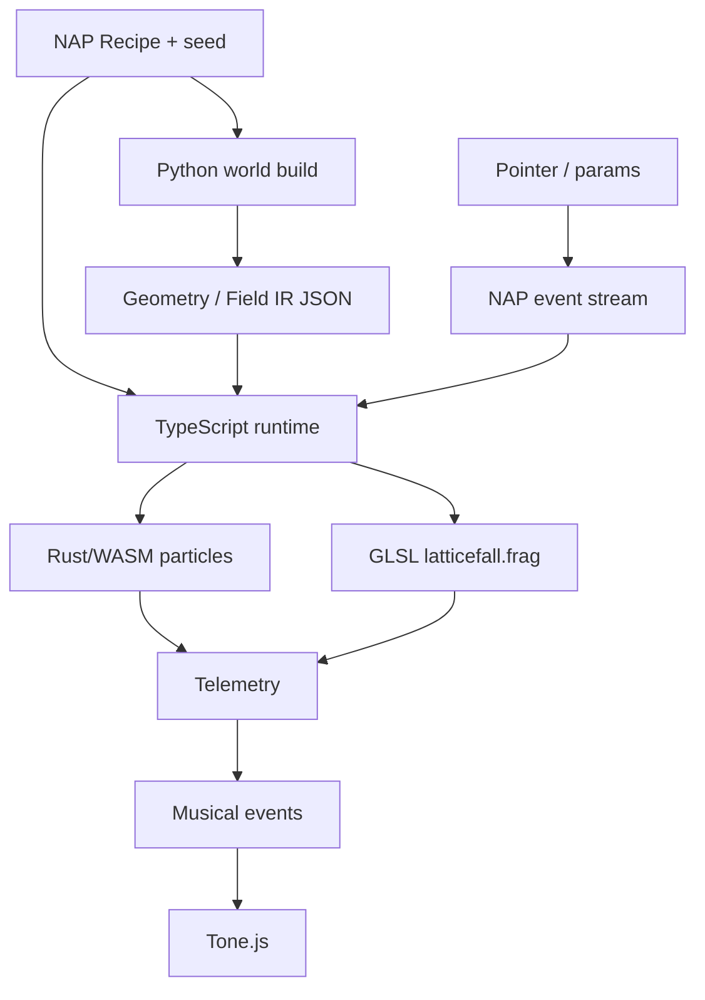

# LATTICEFALL

Flagship NUMBRANE artwork: a Euclidean sacred-geometry machine that gradually
discovers nonlinear dynamics — fields, particles, escape-time fractals, and
telemetry-driven music — across Python, Rust/WASM, TypeScript, GLSL, and Tone.js.

No AI / ML / diffusion / model inference. Mathematics, simulation, shaders, DSP,
and human interaction only.

## Artistic concept

1. **ORDER** — Metatron / Flower-of-Life lattice establishes itself.
2. **DRIFT** — Curl + lattice vector field becomes visible through particles.
3. **FRACTURE** — Escape-time / plasma structures penetrate the composition.
4. **FALL** — Nonlinear systems dominate; lattice influence destabilizes.
5. **AFTERIMAGE** — Sparse residue; original order remains faintly perceptible.

## Language responsibilities

| Layer | Role |
|-------|------|
| **Python** | Offline world build: geometry IR, field contract summary, phase timing, named seed streams |
| **Rust/WASM** | Live deterministic particle/advection simulation (`LatticefallSim`) |
| **TypeScript** | Conductor: recipe/world load, NAP events, phases, telemetry, music events, WebGL, Tone |
| **GLSL** | `latticefall.frag` — lattice mask + particle density + plasma/escape composite |
| **Tone.js** | Live scheduling of *deterministically generated* musical events |



## Seed semantics

One recipe `seed` (u32) derives independent named streams via FNV-1a + XOR +
one splitmix32 step (identical in Python, Rust, TypeScript):

`geometry`, `field`, `particles`, `fractal`, `palette`, `audio`, `interaction`

Adding draws on `audio` never changes the `particles` sequence.

## Interaction → replay

```text
DOM input → NAP event → runtime reducer → simulation / controls
```

Record: `window.__LATTICEFALL__.exportEvents()` while running `just latticefall`.

Replay fixture: `tests/fixtures/latticefall-session.json`

```bash
just latticefall
just latticefall-replay
just latticefall-smoke   # Playwright: WebGL + WASM + digest equality
```

## Commands

```bash
just latticefall-build
just latticefall              # live
just dev-web latticefall
just latticefall-test
just latticefall-smoke
numbrane render flagship/latticefall --seed 42
```

## Determinism

- Logical time `t = frame / fps` only in simulation + shaders.
- Semantic state digests (not screenshot hashes) for replay proof.
- WASM failure is fatal (no silent JS particle fallback).
- Audio *playback* timing is live-only; event generation is deterministic.

## Telemetry → audio

| Channel | Producer (summary) | Musical effect |
|---------|--------------------|----------------|
| energy | speed + particle energy + field mag | dynamics / reverb wet |
| motion | displacement + direction variance | delay wet / density |
| texture | spatial density variance | harmonic density / feedback |
| spectral | fractal pressure + field | register / timbre voice |

## Recipes

- `recipe.default.json` — balanced collapse arc
- `recipe.calm.json` — slower field, lower chaos
- `recipe.collapse.json` — aggressive fractal pressure

## Reference stills

Deterministic screenshots (not committed; regenerate locally):

```bash
# worlds for seeds 1, 42, 137, 2026 live under engines/web/public/latticefall/
# capture via Playwright into artifacts/latticefall/stills/ (gitignored)
```

Command documented in `docs/web-engine.md`. Approximate live HUD timings on software GL:
`wasm ≈ 0.1–0.3 ms/step` at 1400 particles; `draw ≈ 1–3 ms` (SwiftShader).
